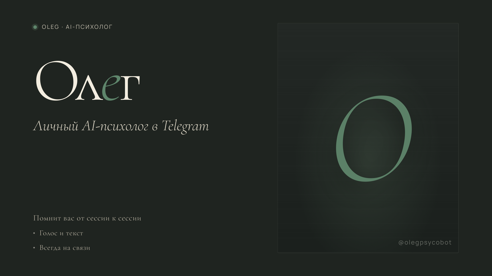
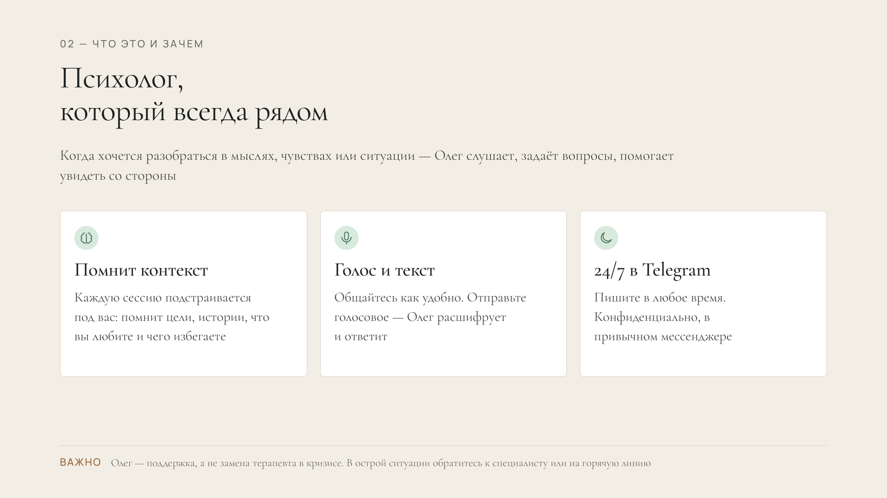
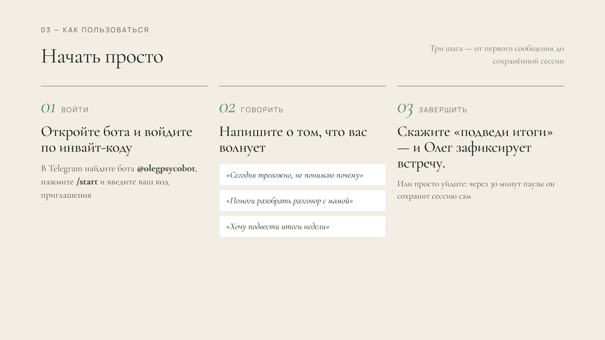
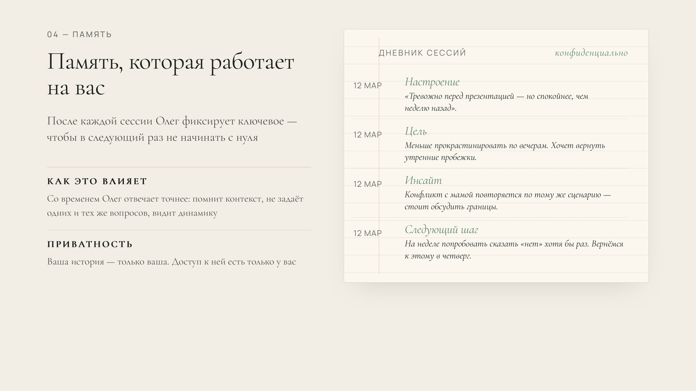

# Oleg Psychologist Demo

Очищенный demo repo для проекта персонального AI-психолога с долгосрочной памятью.

Это не прямая копия production-проекта. Оригинальный проект связан с чувствительной психологической перепиской, поэтому публичная версия показывает архитектурные решения на синтетических данных и без внешних API.

## Демо

Слайды презентации продукта — обложка, концепция, пользовательский путь, работа памяти.

<p align="center">
  
</p>
<p align="center">
  
</p>
<p align="center">
  
</p>
<p align="center">
  
</p>

## Что показывает проект

- Long-term memory workflow для AI-assistant.
- Разделение текущей сессии и долгосрочной памяти.
- Сохранение summary, mood, goals, next steps и key facts.
- Поиск релевантных прошлых сессий перед ответом.
- Постепенное обновление профиля пользователя.
- Safety boundaries для кризисных, медицинских и юридических запросов.
- Честную упаковку чувствительного проекта для портфолио без публикации личных данных.

## Почему это demo, а не production dump

Полная рабочая версия содержит чувствительную предметную область: личные сессии, психологический профиль, owner IDs, production prompts, Supabase details, webhook/deploy settings. Это нельзя безопасно публиковать.

Вместо этого репозиторий демонстрирует саму архитектуру:

- как устроен session buffer;
- когда сессия сохраняется в память;
- как выбираются релевантные воспоминания;
- как профиль обновляется только из явных фактов;
- как prompt context собирает профиль, память и текущий запрос;
- где стоят safety ограничения.

## Стек

- Python 3.12+
- stdlib-only demo implementation
- pytest

## Запуск

```bash
python -m venv .venv
source .venv/bin/activate
pip install -e ".[dev]"
python -m psychologist_memory_demo.demo
```

## Проверка

```bash
pytest
```

Тесты используют только синтетические сообщения и не обращаются к Telegram, OpenAI, Supabase или другим внешним сервисам.

## Структура

```text
src/psychologist_memory_demo/
  models.py          dataclasses для сообщений, памяти и профиля
  safety.py          crisis/medical/legal boundary checks
  memory.py          in-memory vector-like search
  session.py         session buffer, save triggers, summary generation
  prompt.py          prompt context builder
  demo.py            CLI demo
docs/architecture.md
tests/test_memory_workflow.py
```

## Ограничения и безопасность

- Это не медицинская услуга, не психотерапия и не замена специалиста.
- Demo не ставит диагнозы, не назначает лечение и не обрабатывает реальные кризисные ситуации.
- В кризисной ситуации пользователь должен обращаться в местную экстренную службу или к специалисту.
- В репозитории нет реальных сессий, профилей, токенов, Supabase keys, Telegram IDs, доменов, IP или VPS-путей.

## Портфельная рамка

Проект представлен как AI-assisted architecture case study: как спроектировать чувствительный AI-assistant с памятью, приватностью, ограничениями безопасности и понятным workflow.
